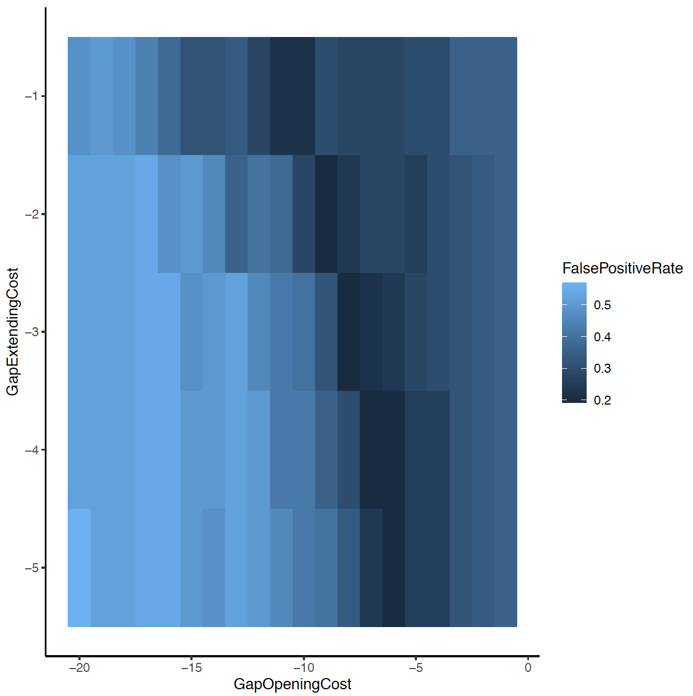
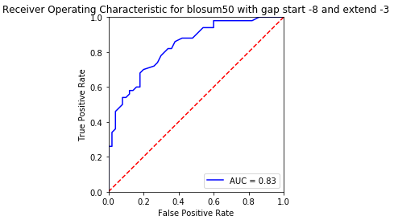
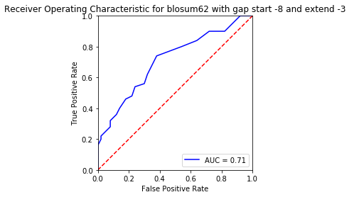
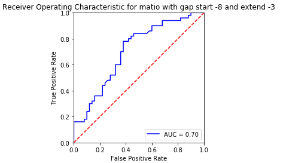
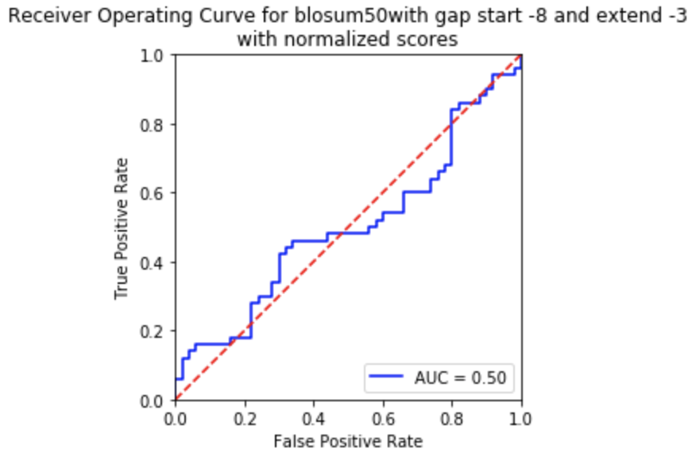
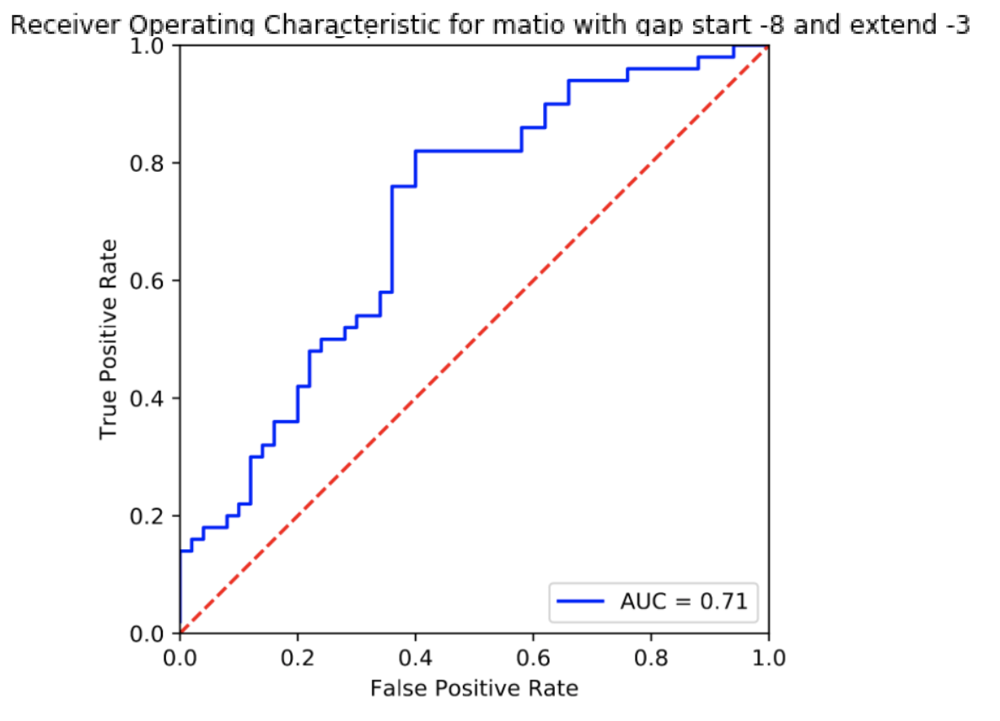

# Write Up Final: Constructing a Neural Network

[](https://travis-ci.org/cechlauren/HW3_skeleton)

Contains: autoencoder and predictions for RAP1 binding sites.

## STRUCTURE
```
.
├── README.md
├── requirements.txt
├── various .png
│   ...
├── NNfxns
│   ├── neural_network.py
│   ├── auto.py
│   └── train.py
├── test
│    └── test_auto.py
└── ROCplots
    ├── blosum50_8_3.png
    └── matio_8_3.png
```

Any dependencies noted in `requirements.txt`. 

## Building an autoencoder:
## Background
Autoencoders are a type of feedforward neural networks where the input is the same thing as the output. Basically, they will take the input and squish it into a low dimension summary code that represents what should be reconstructed in the output. To make an autoencoder (and later on a neural network), one needs at least three things: (1) an encoding method, (2) a decoding method, and (3) a loss function. The encoder and decoder are fully connected feedforward NN, while the code is a single layer of artificial NN that has a hyperparameter-defined number of nodes. Additional hyperparameters that should be set before training are: (1) code size, (2) number of layers, (3) number of nodes per layer, and (4) a loss function like MSE or binary crossentropy. Some of those hyperparameters were already set for us in this final…

## Implementation: reconstructing an 8x8 identity matrix with an autoencoder containing 3 hidden neurons
The 8x3x8 autoencoder used specifically to process the 8bit data can be found here [auto.py](https://github.com/cechlauren/final/blob/master/NNfxns/auto.py).

The input is represented here for ease of testing by others [eightBit.txt](https://github.com/cechlauren/final/blob/master/data/eightBit.txt).

The function that produces the reconstruction is here [test_auto.py](https://github.com/cechlauren/final/blob/master/test/test_auto.py). 


The input for this autoencoder was as an 8x8 identity matrix made using 
<br />

which makes this

<br />

If you see nothing, see:
[8by8code.png](https://github.com/cechlauren/final/blob/master/8by8code.png) and
[8by8.png](https://github.com/cechlauren/final/blob/master/8by8.png).

Then the autoencoder vectorizes (ie. reduces the dimension of) the input in a bitwise fashion for the hidden layer(pretty much all of the work is done for the autoencoder already!). 

Then that hidden, reduced encoding is processed by the decoding layer to give an output like the following:

<br />

Also here: [test_auto.png](https://github.com/cechlauren/final/blob/master/test_auto.png).

Its not pretty, but this seems to do pretty well given that I've added quite a bit of noise to the autoencoder.
There seems to be some difference in learning activation for the central section, but I'd say its decent enough since this part doesn't need to be perfect.

## Develop a fully connected neural network that predicts transcription factor binding with the training data provided

### Data Preprocessing: Describe and implement a data preprocessing approach
### DNA Sequence Representation: Describe and implement a way to represent DNA sequence
### Network Architecture: Develop and describe your network architecture
To make something more powerful than the 8x3x8 autoencoder, one can increase the number of layers, nodes per layer, and more importantly the code size. Increasing those hyperparameters allows neural networks to learn more complex codings. Overdoing this part, however, could cause overfitting since the NN will simply learn to copy the inputs as the output without learning anything meaningful. By making more of a sandwich where the code size is small, the NN won’t be able to directly copy the input to the output and so is forced to learn representative features. 
Sometimes we can force an NN to learn useful features by adding random noise so that the NN must determine the meaningful data. 


## Training Regime: Develop a training regime (K-fold cross validation, bagging, etc) to test model 
### Describe and implement the regime and answer question 3 subquestions 

## Cross-Validation: Perform cross-validation experiments to test model hyperparameters
### Develop and describe your choice of model hyperparameters
### Question 4

## Testing: Test model performance on test data


Consider the false positive rate (proportion of negative pairs with scores that exceed
a score threshold) when the true positive rate (proportion of positive pairs with scores
above the threshold) is 0.7. 
-What's the best false positive rate that you can achieve with varying both gap opening (from 1 to 20) and extension penalties (from 1 to 5) with the BLOSUM50 matrix? 
-What is the best gap penalty combination?

The best (read lowest) false positive rate I could achieve was 20% when varying gap opening/extension given a true positive rate of 70%.  This is shown in [optimalgaps.py](https://github.com/cechlauren/HW3_skeleton/blob/master/hw3align/optimalgaps.py).
R was used to plot this data (a table of values fpr values for each combinatino of gap opening/extension), which can be found in [gapPenalties.txt](https://github.com/cechlauren/HW3_skeleton/blob/master/hw3align/gapPenalities.txt), to find the optimal combination of gap penalties. 
Here is the R script: [OptimizeGapsRscript.txt](https://github.com/cechlauren/HW3_skeleton/blob/master/OptimizeGapsRscript.txt).

We determine all true positive alignment scores to find the cutoff that sets true positive rate at 70%; they range from roughly 35-250.
The FPR will then be the count of neg. scores above the cutoff we designated, divided by the number of true negatives. This is all described in [optimalgaps.py](https://github.com/cechlauren/HW3_skeleton/blob/master/hw3align/optimalgaps.py).

So, using those cutoffs, we get the following false positive rate distribution:
<br />
If you see nothing, also see: [optimizeGapPenalitiesPlot.pdf](https://github.com/cechlauren/HW3_skeleton/blob/master/optimizeGapPenalitiesPlot.pdf)

I found several combinations [lowestFPR.png](https://github.com/cechlauren/HW3_skeleton/blob/master/lowestFPR.png) that result in a 20% FPR, but decided to go with the less extreme case where

Gap opening: -8
Gap extension: -3


The following analyses will use the above affine penalties.

### Question 2
-Using the gap penalties you determined from question 1, which of the provided
scoring matrices performs the best, in terms of false positive rate (at a true positive rate
of 0.7)? 
-What are the performance rates of each of the matrices? 

To identify the best scoring matrix based on the best affine penalities I identified in question 1 I calculated and plotted the respective scores using [roc.py](https://github.com/cechlauren/HW3_skeleton/blob/master/hw3align/roc.py). 
All plots can be viewed in this directory: [ROCplots](https://github.com/cechlauren/HW3_skeleton/tree/master/ROCplots).
The following are the unnormalized ROC for each scoring matrix:

<br />

<br />

<br />

<br />

<br />

So, in summary, the false positive rates for each matrix at a 70% true positive rate are:
- **BLOSUM50: 20%**
- BLOSUM62: 40%
- PAM100: 30%
- PAM250: 25%
- MATIO: 35%

The BLOSUM50 and PAM250 matrices have the same AUC, but the false positive rate for BLOSUM50 is superior at the TPR designated in this assignment. Unexpectedly, the MATIO did not perform worst overall...but does have the lowest initial TPR.

### Question 3

-How does the performance change if you normalize the Smith-Waterman scores by
the length of the shortest sequence in a pair (i.e. divide the raw score by the min
length)? Show the ROC curves for your best matrix and for the same matrix with
normalized scores. 
-Are the false positive rates better or worse? 
-Why do you think this is so?

To be frank, these normalized ROCs look terrible. 
Here is the best matrix non-normalized:
<br />

And here it is normalized (see code: [roc.py](https://github.com/cechlauren/HW3_skeleton/blob/master/hw3align/roc.py) ) by the shortest sequence length of a pair:

<br />

Reporting the FPR at 70% TP level:
- **BLOSUM50: 80%**
- BLOSUM62: 90%
- PAM100: 83%
- **PAM250: 75%**
- MATIO: 85%

Although these FPR are distinctly worse, it is encouraging to see that BLOSUM50 still performs well relative to the others under normalized conditions.  PAM250 also performs well. Both have the same AUC. See directory [ROCplots](https://github.com/cechlauren/HW3_skeleton/tree/master/ROCplots) for normalized plots.

These worsened scores displayed by the normalized plots indicate that normalization likely impairs the SW function's ability to distinguish between the pairs designated as positives and negatives. I'm guessing if you were to compare non-normalized to normalized scores distributions, the extent of distributions would be closer in normalized conditions.
Given how normalizing to the smallest sequence affected the FPR, I might hypothesize that the SW function works better at finding a local match when the two sequences are longer (esp if the positive pairs set has longer sequences). Maybe we could try training with datasets that have similar distributions of sequence lengths to confirm this?

## Questions Part 2

## Question 1/2/3

-Using the best gap penalties and matrix from part 1, create an alignment for each positive pair of sequences and each negative pair of sequences. You will use these static alignments as a starting point from which to optimize a scoring matrix to maximize separation of scores of the positive and negative pairs.

-Devise an optimization algorithm to modify the values in a starting score matrix such as to maximize the following objective function: sum of TP rates for FP rates of 0.0, 0.1, 0.2, and 0.3. The maximum value for the objective function is 4.0 (where you are getting perfect separation of positive and negative pairs even at the lowest false positive rate).

I'll proceed with the BLOSUM50 matrix because of its better initial FPR in the non-normalized instance. 
To see how the objective function was maximized: [optimalmatrix.py](https://github.com/cechlauren/HW3_skeleton/blob/master/hw3align/optimalmatrix.py) and look for "optimizeMatrix_geneticAlg".

The function works by optimizing an alignment score matrix with a genetic algorithm. The function will stop if it hits a certain number of iterations (a parameter we can put in), or if it doesn't see a new objective function value in the top of the library where we track the best scoring matrices to repopulate with in a certain number of steps without improvement. The function returns a final population of matrices, the scores for matrices at the last step taken, the library of best matrices, and a list of the mean objective function value at each step taken. 

The best matrix for BLOSUM50 is here: [optimalblosum.txt](https://github.com/cechlauren/HW3_skeleton/blob/master/hw3align/optimalblosum.txt)
The best matrix for MATIO is here: [optimalmatio.txt](https://github.com/cechlauren/HW3_skeleton/blob/master/hw3align/optimalmatio.txt)

When I look at the scores and objective means for these optimized matrices, I see on average:
-BLOSUM50 score improves up to +0.4 from starting around 2.04-2.18
-BLOSUM50 objective means highest hover around 2.3
-MATIO score improves up to +0.2 from starting around 1.96-2.0
-MATIO objective means highest hover around 2.05
See: [objectivemeans.png](https://github.com/cechlauren/HW3_skeleton/blob/master/objectivemeans.png).
I would have expected to see better improvement, maybe I did something wrong.

When the sequences have been realigned and rescored, the ROC curves look somewhat similar to the original matrix. 
Optimized BLOSUM50:
<br />

Optimized MATIO:
<br />


It would appear that the only major changes were in the AUCs, and indicates that SW function was likely overfitting some alignment features.


## Question 4
-Describe your optimization algorithm briefly. How might you improve it?
If needed again, see: [optimalmatrix.py](https://github.com/cechlauren/HW3_skeleton/blob/master/hw3align/optimalmatrix.py)
This optimization uses an evolutionary algorithm approach called a "genetic algorithm". 
In plain English, optimization often starts with some initial values for an experiment that may not be the best to use, so it would be prudent to change them until we get those best values. In terms of a genetic algorithm then, we might recall "survival of the fittest." The genetic algorithm must work on a **population** to be selected upon. The size of the population is the number of individuals, or **solutions**. An individual can be described by their chromosomes, or **features**, where the genes are binary values. Given this concept, we can consider that each solution likely has a fitness associated with it, and therefore we can apply a fitness function to find the best quality ones. Higher quality solutions have the best chance of surviving. You can initialize by representing each solution and selecting an appropriate number of individuals for it. The threshold will determine the individuals that will move on based on their fitness value...we see these as cutoffs in the scoring matrix part of the optimization alg.
When used to find the optimal matrices for BLOSUM50 and MATIO, the inputs were:
- a population of 100-1000 matrices
- a mutation probability of 45%
- iteration stop of 800 rounds
- OR if no new matrices made in top 10, then stop at 100
- selection pressure =2

The matrices are scored based on the objective fxn (sum of TP rates for FP rates of 0.0, 0.1,
0.2, and 0.3.). The scores resulting from that (I've mentioned above) will be normalized since they will be used in sampling with replacement, which allows the creation of a new generation of matrices that will hopefully have improved output. Of course, if we're always propagating with the best matrices and we could somehow find a way to prioritize those in our population, it would be a lot faster to find those optimal matrices. 
When I look at some of the true positive alignments, I wonder how accurate these scores really are, or if these true positive alignments seem biologically possible. If I had more time, I'd make comparisons between my SW fxn results and that of a more widely used platform like BLAST.
I'd also like to explore some ways to prevent my function from overfitting the datasets, as this seems to be a major issue.

## Question 5
-What would be required in order to make a convincing case that an optimized matrix
will be of general utility and will actually be beneficial for people to use in searching
databases?

I think the best case for using an optimized matrix would be if the new one could consistently distinguish a new set of pos/neg examples that have varying lengths and distinct sequences to the training set examples. Basically, if we still had a test set, in addition to the training set we already used, and we found that this optimized matrix could still perform well I'd be convinced to pursue its use further. As I briefly mentioned above, it would also be useful to use another approach/program to test how it works.

Ref and citations:
https://bmcbioinformatics.biomedcentral.com/articles/10.1186/1471-2105-10-396
https://bioinformaticshome.com/bioinformatics_tutorials/sequence_alignment/how_to_select_right_matrix.html
http://darlinglab.org/tutorials/alignment.py
https://www.geeksforgeeks.org/sequence-alignment-problem/
