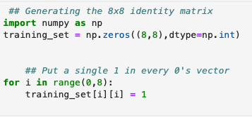
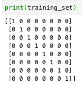
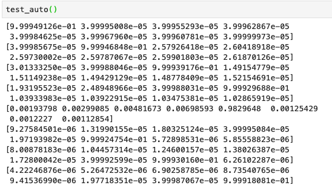
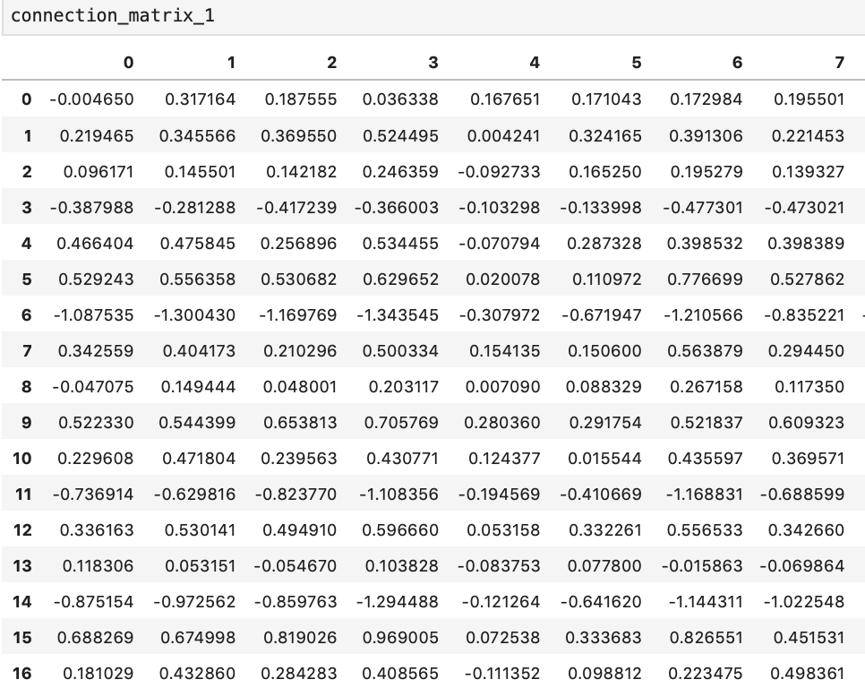
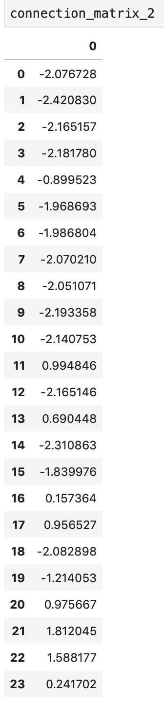
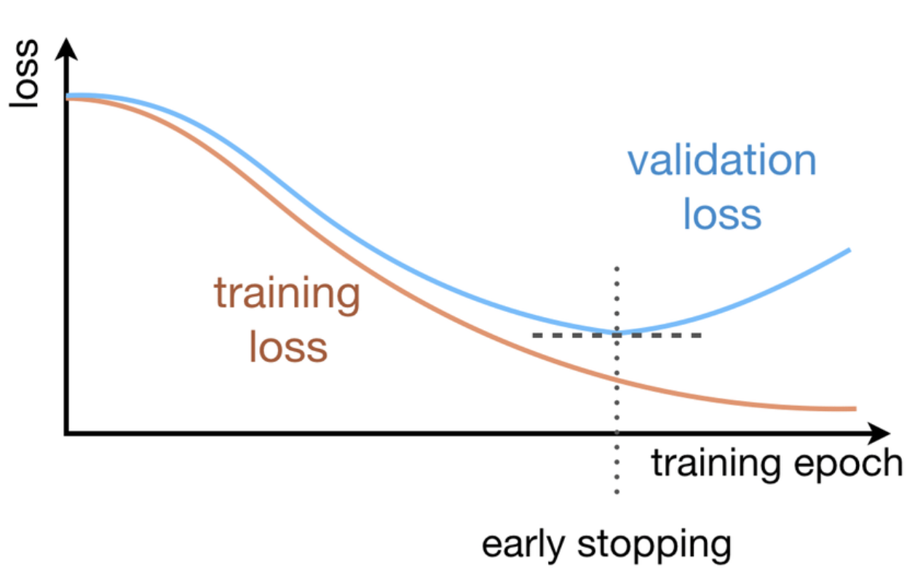
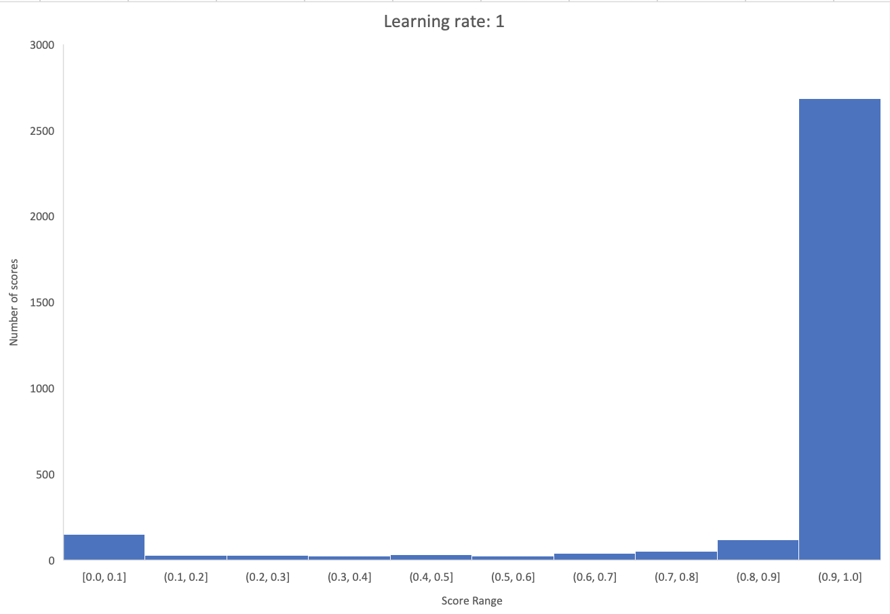
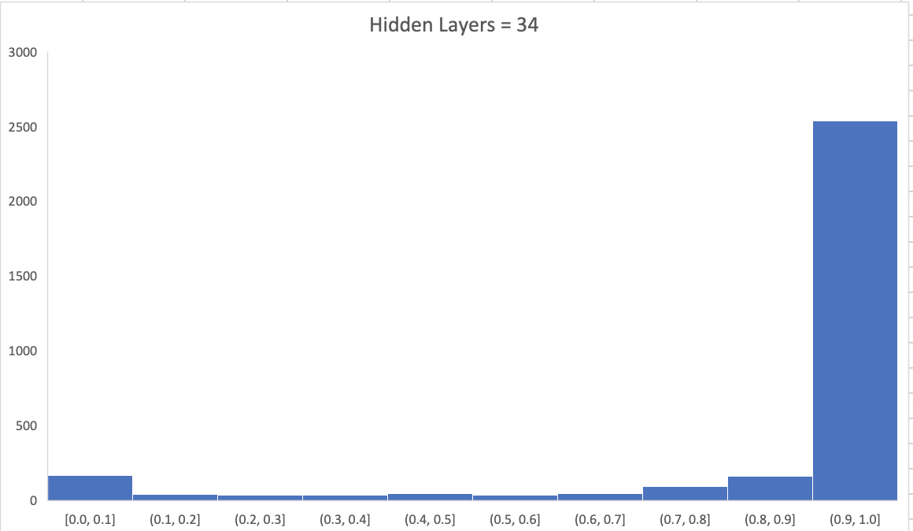

# Write Up Final: Constructing a Neural Network

[](https://travis-ci.org/cechlauren/HW3_skeleton)

Contains: autoencoder and predictions for RAP1 binding sites.

## STRUCTURE
```
.
├── README.md
├── requirements.txt
├── various .png
│   ...
├── NNfxns
│   ├── neural_network.py
│   ├── auto.py
│   └── train.py
├── test
│    └── test_auto.py
└── Jupyter notebook
    ├── 8x8 reconstruction
    └── other workflow
```

Any dependencies noted in `requirements.txt`. 

## BUILDING AN AUTOENCODER
## Background
Autoencoders are a type of feedforward neural networks where the input is the same thing as the output. Basically, they will take the input and squish it into a low dimension summary code that represents what should be reconstructed in the output. To make an autoencoder (and later on a neural network), one needs at least three things: (1) an encoding method, (2) a decoding method, and (3) a loss function. The encoder and decoder are fully connected feedforward NN, while the code is a single layer of artificial NN that has a hyperparameter-defined number of nodes. Additional hyperparameters that should be set before training are: (1) code size, (2) number of layers, (3) number of nodes per layer, and (4) a loss function like MSE or binary crossentropy. Some of those hyperparameters were already set for us in this final…

## Implementation: reconstructing an 8x8 identity matrix with an autoencoder containing 3 hidden neurons
The 8x3x8 autoencoder used specifically to process the 8bit data can be found here [auto.py](https://github.com/cechlauren/final/blob/master/NNfxns/auto.py).

The input is represented here for ease of testing by others [eightBit.txt](https://github.com/cechlauren/final/blob/master/data/eightBit.txt).

The function that produces the reconstruction is here [test_auto.py](https://github.com/cechlauren/final/blob/master/test/test_auto.py). 


The input for this autoencoder was as an 8x8 identity matrix made using 
<br />

which makes this

<br />

If you see nothing, see:
[8by8code.png](https://github.com/cechlauren/final/blob/master/8by8code.png) and
[8by8.png](https://github.com/cechlauren/final/blob/master/8by8.png).

Then the autoencoder vectorizes (ie. reduces the dimension of) the input in a bitwise fashion for the hidden layer(pretty much all of the work is done for the autoencoder already!). 

Then that hidden, reduced encoding is processed by the decoding layer to give an output like the following:

<br />

Also here: [test_auto.png](https://github.com/cechlauren/final/blob/master/test_auto.png) or viewable in Jupyter notebook.

Its not pretty, but this seems to do pretty well given that I've added quite a bit of noise to the autoencoder.
There seems to be some difference in learning activation for the central section, but I'd say its decent enough since this part doesn't need to be perfect.

## DEVELOP A NEURAL NETWORK PREDICTING TF BINDING

### Data Preprocessing: Describe and implement a data preprocessing approach
How one prepares the NN data is probably one of the more imporant parts to getting reasonable predictions; "crap in, crap out" as they say. 

There are ~137 positive sequences each with 17 nucleotides that describe RAP1 binding sites. Its possible that our negatives, which are ~1000 nucleotides long, contain at least partial positives. Thus, we may see some terrible predictions if our negatives aren't really negatives. 

One way to do that might be breaking up the negatives into 17 nucleotide chunks and comparing it with the positive set over and over (ie. recycle them) until one runs through the all the distinct negatives. See line 57 in [train.py](https://github.com/cechlauren/final/blob/master/NNfxns/train.py).

```
partitions = int(args['<partitions>']) #partitions: the number of different parts we should make for cross-validation
    neg_division = len(negative_sites) / float(partitions) # how many partitions we can make from the sites given
    neg_randomly_partitioned_list = [negative_sites[int(round(neg_division * i)): int(round(neg_division * (i + 1)))]
                                     for i in range(partitions)] # makes a list of those partitions thru each site

    pos_division = len(positive_sites) / float(partitions) # ditto ^^
    pos_randomly_partitioned_list = [positive_sites[int(round(pos_division * i)): int(round(pos_division * (i + 1)))]
                                     for i in range(partitions)]

```

One will import the RAP1 binding sites and the negative sites (parsing the fasta for the 1000 bases).
Then for each sequence, iterate over each 17 base chunk and train with an expected of 0 for neg and 1 for pos. 

Clearly, the number of negative instances is going to be much more than that of positives. 

Some ways to deal with this might be:
- increasing our positives (small effect overall)
- making the positive:negative ratio 1:1 (large effect overall)

The latter point supports a decision to train against all positive training sites for every 137 negative training instances.


### DNA Sequence Representation: Describe and implement a way to represent DNA sequence

There are 4 different nucleotides potentially describing each base in the given sequences. Each nucleotide can be represented in a bitwise fashion using one-hot encoding. For example, from this code: [neural_network.py](https://github.com/cechlauren/final/blob/master/NNfxns/neural_network.py)
```
self.base_binary_conversion = {'A': '0001',
                                       'C': '0010',
                                       'T': '0100',
                                       'G': '1000'
                                       }
```

Not only is this a binary (read less memory) representation, but can be adjusted for wildcard nucleotides, or we can change how we assign each nucleotide if we think there may be a bias for certain nucleotides in the training set (we don't want certain features to overpower the others just because there happens to be randomly more 'G' rich sequences in the training set, for instance.

For this NN, the input_DNA string 'GA' would be vectorized like this:

```
self.base_binary_conversion = {'A': '0001',
                                       'C': '0010',
                                       'T': '0100',
                                       'G': '1000'
                                       }
...                                       
                                       
def _construct_input_vector(self, input_DNA):
       
        temp_vector_list = []

        for base in input_DNA:
            for number in self.base_binary_conversion[base]:
                temp_vector_list.append(float(number))

        self.input_vector = np.asarray(temp_vector_list)

```
This may end up looking like 
```
[10000 
0001]

```

or more likely
```
[.99910 0.00001 0.00001 0.00001
 0.00001 0.00001 0.00001 .99910]

```


### Network Architecture: Develop and describe your network architecture
To make something more powerful than the 8x3x8 autoencoder, one can increase the number of layers, nodes per layer, and more importantly the code size. Increasing those hyperparameters allows neural networks to learn more complex codings. Overdoing this part, however, could cause overfitting since the NN will simply learn to copy the inputs as the output without learning anything meaningful. By making more of a sandwich where the code size is small, the NN won’t be able to directly copy the input to the output and so is forced to learn representative features. 
Sometimes we can force an NN to learn useful features by adding random noise so that the NN must determine the meaningful data. 

In this instance we have :
* Input layer with 17*4 nodes (because 17 different nucleotides defining each sequence, and 4 different
          possible nucleotides describing those positions) + bias 
* Hidden layer with 23-35 nodes (merge at least 2 input neurons)+ bias   
* One output layer node (number of neurons in the output layer will equal the number of outputs associated with each input; we want one answer)
* All with sigmoid activation

The network will accept 17 base units and will output a value from around 0 to around 1, where 0 is not a RAP1 binding site.
 

## TRAINING REGIME
### Describe and implement the regime
All described in [train.py](https://github.com/cechlauren/final/blob/master/NNfxns/train.py) but in short:
1. split up neg sites into 17nt chunks, and randomize order of all 17nt positives
2. for each neg chunk, we say the negatives are negative (0)
3. keep track of all the negatives we go thru, and once we reach the length of the positives list, then we test on the postives
4. for each pos chunk, we say the positives are not negative
5. back to negatives we left off on...and repeat
6. once the changes in errors are low enough, we stop

*there were some instances where the negatives had positive homology, so took those out.*
*not sure if the order is correct but found those at slice 4 , 5, and 9 after moving onto the next block of negatives post-positive testing.*

7. Choose the connection matrix that has the greatest separation between the average positive and negative scores.
See: 

<br />

(69 rows by 23 columns (bc 68 input layer+ 1 ouput layer, and 23 hidden layer))
or [connection_matrix_1.csv](https://github.com/cechlauren/final/blob/master/connection_matrix_1.csv)


<br />

or [connection_matrix_2.csv](https://github.com/cechlauren/final/blob/master/connection_matrix_2.csv)


### Answer question 3 subquestions 

- How was your training regime designed so as to prevent the negative training data from overwhelming the positive training data?

See answer above in Data Preprocessing.
But in short, I resampled from the positives, while using all 17 nt chunks possible from each negative instance.
May have been interesting to train on negative examples that had higher homology, rather than just pooling all of those negative instances together...that way the NN would have a better chance at learning the features that separate RAP1 sites.


- What was your stop criterion for convergence in your learned parameters? How did you decide this?
In most instances, there are three distinct splits of data. In one we train, in the others we test and validate. When we train, we train across epochs and evaluate loss. If we visualize this, it produces what's called a "loss curve." 
Sometimes we do early stopping if things dont change towards the end of the curve. Like if it looks flat and doesn't change. 
On the test curve we see something similar, but the curve will start to go back up after a certain amount of epochs. 
That's what overfitting looks like. Ideally, we'd stop training at the intersect of the training/test curves, or at least before the test curve starts diverging. Like this: 

<br />

Sometimes, people just do early stopping at a time they think is appropriate. This was how I classified my stop criterion, based on the error that I had stored in my NN matrix:
```
if any([max_change_1 < 0.00000000001 and max_change_1 > 0,
                        min_change_1 > -.00000000001 and min_change_1 < 0]) and any(
                    [max_change_2 < 0.00000000001 and max_change_2 > 0,
                     min_change_2 > -0.00000000001 and min_change_2 < 0]):
                    print("Stop criterion met after {} iterations".format(counter))

```


## CROSS VALIDATION
### Develop and describe your choice of model hyperparameters
Several hyperparameters have already been discussed in this write-up.

I have not discussed bias. I have added bias to my input and hidden layers. The bias provides some flexibility and generalization for the neural network model. A mathmatical equivalent would be b in y=mx+b. We can shift our activation function left or right, adjust the weighted sum of the inputs to the neuron, and adjust the output. Example:


```
def forward_propogation(self):
        # Generates hidden layer outputs
        
        output_one_list = []

        for element in np.nditer(np.dot(self.input_with_bias, self.matrix_1_bias)):
            output_one_list.append(self._sigmoid_function(element))
        self.hidden_layer_output = np.asarray(output_one_list)

        # Calculate the square derivate matrix for the hidden layer outputs
        
        for position, value in enumerate(self.hidden_layer_output):
            self.hidden_dx_matrix[position][position] = self._sigmoid_function_derivative(value)
            
... also done on the hidden layer
```


### Question 4
- Describe how you set up your experiment to measure your system's performance. What set of learning parameters works the best? Please provide sample output from your system.
I mainly changed the learning rate. I tried a few but settled on alpha = 1.
Here's what the distribution of scores looks like for that:

<br />


This is from the test set. I've probably found too many positives, or I messed up my labeling... 

I also tried changing the hidden layers. Here's how those same test set predictions distribute:

<br />

On another note, if I wanted to verify that network loss behaved as expected, I would want to see a good(almost perfect) ROC curve from the training set. 

- What are the effects of altering your system (e.g. number of hidden units or choice of kernel function)? Why do you think you observe these effects?

More hidden neurons means the NN can memorize the dataset. THis means the performance on the training set will be really good, but the catch is that it's overfitting for the test set.
If you try different activation functions (ex: sigmoid v relu), you might see slight differences but not much. I didn't try this, but I'd guess that it would affect processing time the most. 
- What other parameters, if any, affect performance?
I'd guess that a regularization function might be appropriate in instances where we saw neuron dropout. 

## TESTING PERFORMANCE 
* For alpha = 1: [predictions.txt](https://github.com/cechlauren/final/blob/master/predictions.txt)


Ref and citations:
https://datascience.stackexchange.com/questions/9443/when-to-use-one-hot-encoding-vs-labelencoder-vs-dictvectorizor
https://stackoverflow.com/questions/2480650/what-is-the-role-of-the-bias-in-neural-networks
https://github.com/jhb86253817/CompNeuro/blob/f5dde5cb0f2e298206f60066150e35ed5e7c3ed4/project1/project_1_template.py
